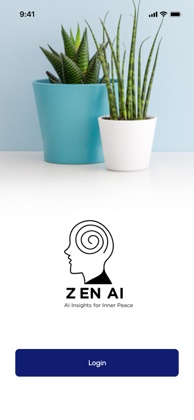
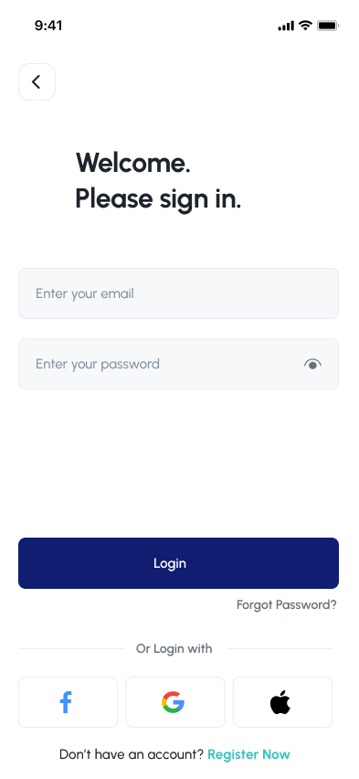
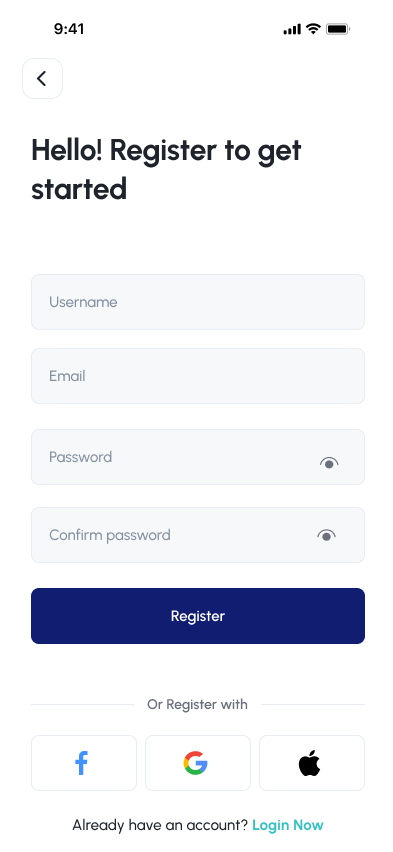

# Zen AI - Mental Wellness App Design

> **Figma Design Portfolio Project**

## 🌟 Project Overview

**Zen AI** is a comprehensive mental wellness application designed to harmonize artificial intelligence with human-centric emotional support. This Figma design showcases a complete mobile app UI/UX for a platform that empowers users to proactively manage their emotional wellbeing.

### 🎯 Design Goals
- Create a calming, accessible interface for mental health support
- Design seamless AI chat integration with empathetic responses
- Build intuitive mood tracking and journaling features
- Connect users with professional psychologists and peer support
- Ensure AA Standard accessibility with proper touch targets

## 🔗 Live Figma Prototype
👉 **[View Interactive Prototype in Figma](https://www.figma.com/proto/DapO9DD1rwjZznHEF0JMp9/AI-Powered-Mental-Health-Assistant?node-id=1-137&t=ekGbNc4g01fW1dC0-0&scaling=scale-down&content-scaling=fixed&page-id=0%3A1&starting-point-node-id=1%3A137)** (opens in new tab)

## 📱 App Screenshots

### Onboarding & Authentication
| Welcome Screen | Login | Register |
|----------------|-------|----------|
|  |  |  |

### Main Dashboard
| Home Screen |
|-------------|
|  |

### AI Chat Features
| Chat with ZenAI | Chat Options | Chat History |
|-----------------|--------------|--------------|
|  |  |  |

### Professional & Peer Support
| Psychologists | Psychologist Chat | Friends List | Friend Chat |
|---------------|-------------------|--------------|-------------|
|  |  |  |  |

### Mood Tracking
| Daily Mood Check | Mood Loaded | Mood History |
|------------------|-------------|--------------|
|  |  |  |

### Journaling
| Daily Entry | Journal Entries |
|-------------|-----------------|
|  |  |

### Analytics & Reports
| Feedback Menu | Daily Report | Weekly Report | Monthly Report |
|---------------|--------------|---------------|----------------|
|  |  |  |  |

## ✨ Key Features Designed

### 🤖 AI-Powered Features
- **Empathetic AI Chat**: ZenAI provides compassionate, therapeutic conversations
- **Behavioral Insights**: AI analyzes mood patterns to offer personalized recommendations
- **Crisis Detection**: Sensitive responses for users in distress

### 👥 Community Support
- **Psychologist Directory**: Browse and connect with verified mental health professionals
- **Peer Matching**: Find friends with similar experiences (grief, depression, PTSD, stress)
- **Secure Messaging**: Private chats with psychologists and peers

### 📊 Mood Tracking
- **Daily Check-ins**: Quick mood logging with emoji-based selection
- **Mood History**: Visual timeline of emotional patterns
- **Trend Analysis**: Weekly and monthly reports with insights

### 📔 Journaling
- **Daily Entries**: Private space for thoughts and reflections
- **Date-based Organization**: Easy retrieval of past entries
- **Mood Context**: Journal entries linked to daily mood data

### 📈 Analytics Dashboard
- **Daily/Weekly/Monthly Views**: Comprehensive mood reporting
- **Average Mood Tracking**: Long-term emotional health monitoring
- **Calendar Integration**: Visual mood calendar

## 🎨 Design System

### Color Palette
- **Primary**: Calming blues and soft neutrals for mental wellness
- **Accent**: Gentle purples for AI interactions
- **Feedback**: Emotion-coded colors for mood indicators

### Typography
- Clean, readable sans-serif fonts
- Hierarchical scaling for information clarity
- Accessible text sizes (44pt minimum touch targets)

### Components
- Custom chat bubbles
- Mood selection interface
- Calendar picker
- Progress indicators
- Profile cards
- Navigation patterns

## 🛠️ Tools Used

- **Figma** - Primary design tool
- **Figma Prototyping** - Interactive flows
- **Component Library** - Reusable design system
- **Auto Layout** - Responsive design
- **Variables** - Design tokens

## 📁 Project Structure
zen-ai-figma-design/
├── README.md
├── screenshots/
│ ├── 01-welcome.png
│ ├── 02-login.png
│ ├── 03-register.png
│ ├── 04-home.png
│ ├── 05-chat-ai.png
│ ├── 06-chat-options.png
│ ├── 07-chat-history.png
│ ├── 08-psychologists.png
│ ├── 09-psychologist-chat.png
│ ├── 10-friends.png
│ ├── 11-friend-chat.png
│ ├── 12-friend-chat-1.png
│ ├── 13-daily-mood.png
│ ├── 14-mood-loaded.png
│ ├── 15-mood-history.png
│ ├── 16-daily-entry.png
│ ├── 17-journal-entries.png
│ ├── 18-feedback.png
│ ├── 19-feedback-daily.png
│ ├── 20-feedback-weekly.png
│ ├── 21-feedback-monthly.png
│ └── 22-load-image.png
└── figma-link.txt

## 🚦 User Flow

1. **Welcome** → Login/Register
2. **Home Dashboard** → Access all features
3. **Mood Check-in** → Daily mood logging → History/Analytics
4. **Journal** → Write entries → View journal history
5. **Chat with ZenAI** → AI support → Professional referral if needed
6. **Community** → Find psychologists → Connect with peers
7. **Feedback** → View reports → Track progress

## 📄 License

© 2026 Siyamthanda Dlakavu. All rights reserved.

---

## 📬 Connect With Me

- **Portfolio**: [siyamthanda-dlakavu-profile.netlify.app](https://siyamthanda-dlakavu-profile.netlify.app/)
- **GitHub**: [github.com/siseko-D](https://github.com/siseko-D)
- **LinkedIn**: [linkedin.com/in/siyamthandad](https://www.linkedin.com/in/siyamthandad/)

---

⭐️ If you like this design, feel free to star the repository!